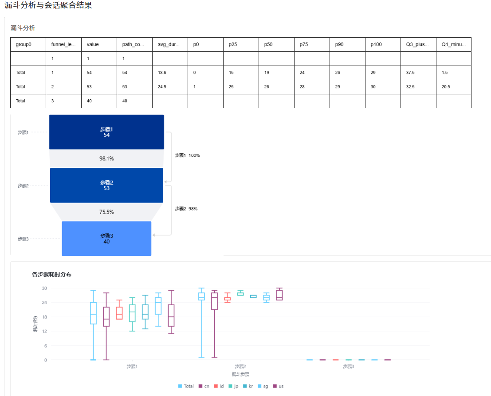
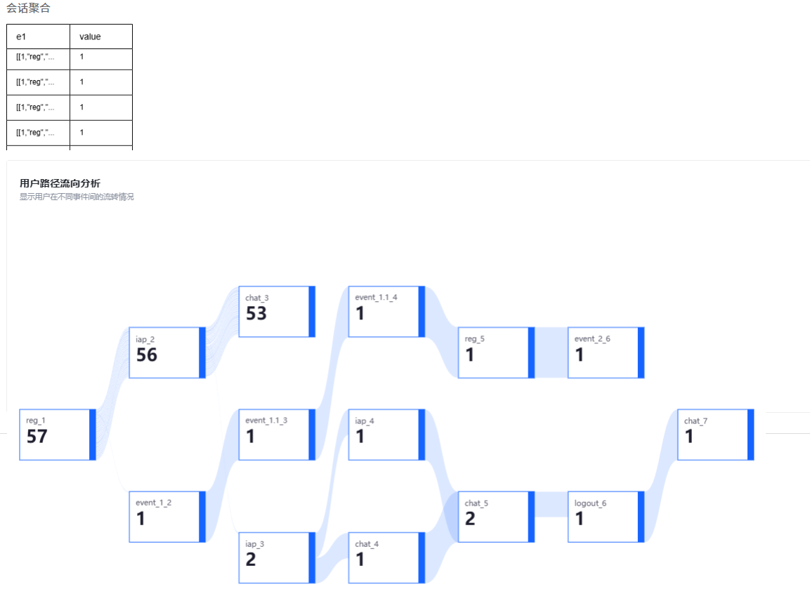

# Doris UDF - WindowFunnel 漏斗分析函数 & SessionAgg 会话聚合函数

这是一个用于Apache Doris的Java UDF函数集合，包含：
- **WindowFunnel**: 专门用于执行漏斗分析，分析用户行为序列，识别符合特定步骤顺序的路径
- **SessionAgg**: 专门用于用户会话聚合，根据标记事件和会话规则聚合用户行为序列

该项目Java代码部分由Ai创建，SHOW YOU MY TALK: .specstory/history
https://share.specstory.com/stories/b773244c-459e-4d77-9cb6-57086131430a
SQL部分还是手动写

## 功能特性

### WindowFunnel 漏斗分析
- 支持多步骤漏斗分析（不限步骤数）
- 可配置的时间窗口和步骤间隔
- 灵活的分析模式
- 支持标签分组，标签自动从事件字符串提取
- 毫秒级时间戳精度
- 支持多条漏斗路径输出
- 支持混合时间格式（毫秒级和秒级）

### SessionAgg 会话聚合
- 支持多种会话标记模式（start/end）
  - **start模式**：从标记事件开始正向构建会话，包含标记事件及后续符合条件的事件
  - **end模式**：从标记事件开始逆序回数路径节点，包含标记事件及之前符合条件的事件
- 可配置的会话间隔和最大步数
- 五种去重模式：default、cons_uniq、session_uniq、cons_uniq_with_group、session_uniq_with_group
- 支持事件分组聚合
- 毫秒级时间戳精度
- 支持混合时间格式（毫秒级和秒级）
- 支持分组值数量控制和自定义替换值

### Vue.js前端应用 (vue-sql-query)
- **漏斗分析可视化**：支持漏斗图、箱型图展示漏斗分析结果
- **会话聚合可视化**：支持桑基图展示用户路径流向分析
- **参数配置界面**：提供友好的参数配置界面，支持实时调整分析参数
- **数据表格展示**：展示原始查询结果数据
- **响应式设计**：支持侧边栏折叠，适配不同屏幕尺寸
- **实时查询**：支持参数调整后实时重新查询和图表更新

### Python后端API服务 (app.py)
- **RESTful API**：提供标准的REST API接口
- **SQL查询代理**：代理前端SQL查询到Doris数据库
- **数据格式转换**：自动处理数据格式转换和错误处理
- **跨域支持**：支持前端跨域请求
- **错误处理**：完善的错误处理和日志记录
- **配置灵活**：支持配置Doris连接参数和API端口

## 项目截图

### 漏斗分析结果（漏斗图+箱型图）


### 会话聚合结果（桑基图）


*注：截图将在项目部署完成后添加，展示实际运行效果*

## 项目结构

```
doris-udf/
├── src/
│   ├── main/java/org/apache/doris/udf/
│   │   ├── UDF.java                    # UDF基类
│   │   ├── WindowFunnel.java           # 漏斗分析UDF实现
│   │   └── SessionAgg.java             # 会话聚合UDF实现
│   └── test/java/org/apache/doris/udf/
│       ├── WindowFunnelTest.java       # 漏斗分析测试类
│       └── SessionAggTest.java         # 会话聚合测试类
├── test-data-csv/                      # 测试数据集目录
│   ├── event_log.csv                   # 主要测试数据集（3个用户）
│   ├── session_agg_test_data.csv       # SessionAgg详细测试数据（15个用户）
│   ├── window_funnel_test_data.csv     # WindowFunnel详细测试数据（11个用户）
│   ├── test_sql_data.csv               # test.sql使用的测试数据
│   ├── requirements.txt                 # Python依赖包列表
│   └── README.md                        # 测试数据集说明文档
├── vue-sql-query/                      # Vue.js前端应用
│   ├── src/
│   │   ├── App.vue                     # 主应用组件
│   │   ├── main.js                     # Vue应用入口
│   │   └── components/                 # Vue组件目录
│   ├── public/                         # 静态资源目录
│   ├── package.json                    # 前端依赖配置
│   ├── vite.config.js                  # Vite构建配置
│   └── README.md                       # 前端项目说明
├── app.py                              # Python后端API服务
├── import_to_doris.py                  # Doris数据导入工具
├── README.md                           # 项目说明
├── test.sql                            # Doris测试SQL脚本
├── build.bat                           # 编译脚本
├── build-jar.bat                       # JAR打包脚本
├── jar2doris.bat                       # JAR包部署到Doris容器脚本
├── run-test.bat                        # Windows下一键执行SQL测试脚本
├── doris-udf-demo.jar                  # 编译生成的JAR包
├── .specstory/                         # SpecStory扩展目录，保存AI对话历史
│   ├── .what-is-this.md                # SpecStory说明文档
│   ├── history/                        # AI对话历史记录
│   └── .gitignore                      # SpecStory Git忽略配置
└── target/                             # 编译输出目录
    └── classes/                        # 编译生成的class文件
        └── org/apache/doris/udf/
            ├── SessionAgg.class
            ├── SessionAgg$1.class
            ├── SessionAgg$EventData.class
            ├── SessionAgg$Session.class
            ├── SessionAggTest.class
            ├── UDF.class
            ├── WindowFunnel.class
            ├── WindowFunnel$1.class
            ├── WindowFunnel$EventData.class
            ├── WindowFunnel$EventRow.class
            ├── WindowFunnel$FunnelPath.class
            ├── WindowFunnel$FunnelResult.class
            └── WindowFunnelTest.class
```

## 快速开始

### 1. 编译与打包

```bash
build.bat         # 编译Java代码并生成JAR包
```

### 2. 部署到Doris容器（Doris v2.1.8）

```bash
jar2doris.bat     # 将JAR包复制到Doris的FE和BE容器中
```

### 3. 启动后端API服务

```bash
python app.py     # 启动Python后端API服务（默认端口5012）
```

**后端功能说明**：
- 提供 `/query` 接口处理前端SQL查询请求
- 自动连接Doris数据库执行查询
- 返回JSON格式的查询结果
- 支持错误处理和日志记录
- 默认监听端口5012，可通过环境变量配置

### 4. 启动前端应用

```bash
cd vue-sql-query  # 进入前端项目目录
npm run dev       # 启动Vue.js开发服务器（默认端口5173）
```

**前端功能说明**：
- 访问 `http://localhost:5173` 打开前端应用
- 左侧参数面板可配置漏斗分析和会话聚合参数
- 支持参数实时调整和查询结果可视化展示
- 提供漏斗图、箱型图、桑基图等多种图表展示
- 支持侧边栏折叠，优化显示空间

### 5. 在Doris中注册UDF

#### WindowFunnel UDF
```sql
CREATE GLOBAL FUNCTION window_funnel_track(INT, INT, STRING, STRING) 
RETURNS STRING 
PROPERTIES (
    "file"="file:///opt/apache-doris/jdbc_drivers/doris-udf-demo.jar",
    "symbol"="org.apache.doris.udf.WindowFunnel",
    "always_nullable"="true",
    "type"="JAVA_UDF"
);
```

#### SessionAgg UDF
```sql
CREATE GLOBAL FUNCTION user_session_agg(STRING, STRING, STRING, INT, INT, INT, STRING, STRING) 
RETURNS STRING 
PROPERTIES (
    "file"="file:///opt/apache-doris/jdbc_drivers/doris-udf-demo.jar",
    "symbol"="org.apache.doris.udf.SessionAgg",
    "always_nullable"="true",
    "type"="JAVA_UDF"
);
```

### 4. 使用示例

#### WindowFunnel 使用示例（直接输出分析结果的语句见test.sql）
```sql
with event_log as (
select '2024-01-01 00:00:00.123' as dt,'payne' as uid,'reg' as event,'tiktok#1' as group0
union all
select '2024-01-01 00:00:01.345' as dt,'payne' as uid,'iap' as event,'tiktok#1' as group0
union all
select '2024-01-01 00:00:03.111' as dt,'payne' as uid,'chat' as event,'tiktok#1' as group0
union all
select '2024-02-01 00:00:00.012' as dt,'payne' as uid,'reg' as event,'fb@,#2' as group0
union all
select '2024-02-01 00:00:01.001' as dt,'payne' as uid,'iap' as event,'fb@,#2' as group0
union all
select '2024-02-01 00:00:02.434' as dt,'payne' as uid,'chat' as event,'fb' as group0
union all
select '2024-01-01 00:00:00.012' as dt,'cjt' as uid,'reg' as event,'f@#,b' as group0
union all
select '2024-01-01 00:00:01.001' as dt,'cjt' as uid,'iap' as event,'f@#,@#,b' as group0
union all
select '2024-01-01 00:00:02.434' as dt,'cjt' as uid,'chat' as event,'fb' as group0
union all
select '2024-01-02 00:00:00.012' as dt,'cjt' as uid,'reg' as event,'f@#,b' as group0
union all
select '2024-01-02 00:00:03.012' as dt,'cjt' as uid,'iap' as event,'f@#,b' as group0
)
, track_udf as (
    SELECT 
        uid,
        group0 as link_col, --关联属性列，不需要就去掉
        window_funnel_track(
            10, 
            5, 
            'default', 
            group_concat(_event_string)
        ) as funnel_result
    FROM (
        select 
            *,
            concat(dt,'#'
            ,event='reg'
            ,'@',event='iap'
            ,'@',event='chat'
            ,'#',group0
            ) as _event_string
        from event_log
    ) t1
    GROUP BY 
    uid
    ,link_col  --关联属性列，不需要就去掉
)
select * 
    from 
    track_udf
    lateral view EXPLODE(cast(funnel_result as ARRAY<varchar>)) tmp as e1
;
```

#### SessionAgg 使用示例（直接输出分析结果的语句见test.sql）
```sql
with event_log as (
select '2024-01-01 00:00:00.123' as dt,'payne' as uid,'reg' as event,'tiktok#1' as group0,'cn' as group1
union all
select '2024-01-01 00:00:01.345' as dt,'payne' as uid,'iap' as event,'tiktok#1' as group0,'cn' as group1
union all
select '2024-01-01 00:00:03.111' as dt,'payne' as uid,'chat' as event,'tiktok#1' as group0,'cn' as group1
union all
select '2024-02-01 00:00:00.012' as dt,'payne' as uid,'reg' as event,'fb@,#2' as group0,'cn' as group1
union all
select '2024-02-01 00:00:01.001' as dt,'payne' as uid,'iap' as event,'fb@,#2' as group0,'cn' as group1
union all
select '2024-02-01 00:00:02.434' as dt,'payne' as uid,'chat' as event,'fb' as group0,'cn' as group1
)
--5种分析模式：default,cons_uniq,session_uniq,cons_uniq_with_group,session_uniq_with_group
,session_udf as (
select 
    path_uid,
    session_agg(
        'reg',
        'start',
        group_concat(path),
        1800,
        10,
        2,
        'replace_value',
        'session_uniq_with_group' 
    ) as session_result
from (
    select
            --哪些列作为分组，就塞到event后面，可以不带任何分组
            json_array(dt,event,group0,group1)  as path,
            uid as path_uid
                from 
            event_log
    ) t1
group by 
    path_uid
)

select 
    e1,
    count(1) as value
from
    session_udf lateral view EXPLODE(cast(session_result as ARRAY<varchar>)) tmp as e1    
group by e1
```

#### SessionAgg end模式使用示例
```sql
-- end模式：从logout事件开始逆序回数路径节点
with event_log as (
select '2024-01-01 00:00:00.000' as dt,'user1' as uid,'login' as event,'product1' as group0,'cn' as group1
union all
select '2024-01-01 00:00:01.000' as dt,'user1' as uid,'iap' as event,'product1' as group0,'cn' as group1
union all
select '2024-01-01 00:00:02.000' as dt,'user1' as uid,'chat' as event,'product1' as group0,'cn' as group1
union all
select '2024-01-01 00:00:03.000' as dt,'user1' as uid,'logout' as event,'product1' as group0,'cn' as group1
union all
select '2024-01-01 00:30:00.000' as dt,'user2' as uid,'login' as event,'product2' as group0,'cn' as group1
union all
select '2024-01-01 00:30:01.000' as dt,'user2' as uid,'iap' as event,'product2' as group0,'cn' as group1
union all
select '2024-01-01 00:30:02.000' as dt,'user2' as uid,'logout' as event,'product2' as group0,'cn' as group1
)
,session_udf as (
select 
    path_uid,
    user_session_agg(
        'logout',           -- 标记事件：logout
        'end',              -- 标记类型：end模式
        group_concat(path),
        1800,               -- 会话间隔：30分钟
        10,                 -- 最大步数：10步
        10,                 -- 分组值最大数量：10个
        '其他',             -- 替换值：其他
        'default'           -- 分析模式：default
    ) as session_result
from (
    select
        json_array(dt,event,group0,group1) as path,
        uid as path_uid
    from event_log
) t1
group by path_uid
)
select 
    e1,
    count(1) as value
from session_udf 
lateral view EXPLODE(cast(session_result as ARRAY<varchar>)) tmp as e1    
group by e1
;
```

**end模式说明**：
- **功能**：从标记事件（如logout）开始逆序回数路径节点
- **应用场景**：分析用户退出前的行为路径，了解用户退出前的操作序列
- **输出结果**：每个会话包含从标记事件开始逆序回数的所有符合条件的事件
- **时间限制**：只包含与标记事件时间间隔在指定范围内的历史事件
- **步数限制**：受最大步数参数控制，从标记事件开始逆序计算

## 详细使用说明

### WindowFunnel UDF函数签名

```sql
window_funnel_track(
    分析窗口时长秒,
    步骤间隔时长秒,
    分析模式,
    事件字符串
)
```

### SessionAgg UDF函数签名

```sql
user_session_agg(
    标记事件名称,
    标记事件类型,
    事件字符串,
    会话间隔时长秒,
    会话最大步数,
    分组值最大数量,
    分组值超过限制时的替换值,
    分析模式
)
```

### SessionAgg 参数说明

- **标记事件名称** (STRING): 用于标记会话开始或结束的事件名称
- **标记事件类型** (STRING): 标记事件的作用类型
  - `start`: 以指定事件作为会话的起始点
  - `end`: 以指定事件作为会话的结束点
- **事件字符串** (STRING): 多条事件拼接的字符串，格式：`["时间戳","事件名",分组字段1,分组字段2,...]`，**分组字段数量可以为0~N个，完全动态**
- **会话间隔时长秒** (INT): 会话内事件的最大时间间隔，超过此间隔将开始新会话
- **会话最大步数** (INT): 单个会话的最大事件步数限制
- **分组值最大数量** (INT): 限制分组维度的数量，按触发的用户路径数降序
- **分组值超过限制时的替换值** (STRING): 当分组值数量超过maxGroupCount时，超出的分组值会被替换为此值
- **分析模式** (STRING): 分析模式，支持以下五种模式：
  - `default`: 默认模式，不做特殊处理，正常对事件排序后按条件返回结果
  - `cons_uniq`: 连续事件去重，例如以iap事件做起始，后续连续发生的iap都不计入会话链条中，如果中间有插入其他事件，后续的iap又会被计入链条中
  - `session_uniq`: 事件严格去重，对比cons_uniq的差异是，任何事件都只会计入一次会话链条中，无论中间是否有插入其他事件
  - `cons_uniq_with_group`: 连续事件去重，但是加入了分组值的判断，例如group为商品id，如果连续购买同一个商品id，则只计1次，如果购买不同的商品id，则会被计入会话链条中
  - `session_uniq_with_group`: 事件严格去重，但是加入了分组值的判断，例如group为商品id，不管是否连续，只要在同一个会话中出现过相同的事件名+分组组合，就不会再计入会话链条中

### SessionAgg 会话合并逻辑

**重要说明**：SessionAgg采用智能会话合并逻辑，确保在会话间隔内的标记事件不会不必要地分割会话。

#### 会话合并规则

1. **会话间隔内标记事件合并**：
   - 当标记事件（如iap）在会话间隔内多次出现时，会被合并为一条路径
   - 例如：`iap,chat,iap`（时间间隔都在1800秒内）→ 返回1条路径：`[[1,"iap","product1","cn"],[2,"chat","product1","cn"],[3,"iap","product2","cn"]]`

2. **会话间隔超时分割**：
   - 当标记事件之间的时间间隔超过设定的会话间隔时，会分割为多条路径
   - 例如：`iap,chat,iap`（第二个iap在31分钟后，超过1800秒间隔）→ 返回2条路径：`[[[1,"iap","product1","cn"],[2,"chat","product1","cn"]],[[1,"iap","product2","cn"]]]`

3. **会话开始逻辑**：
   - 只有在没有当前会话或时间间隔超时时，标记事件才会开始新会话
   - 这避免了不必要的会话分割，提高了分析的准确性

#### 实际应用场景

- **用户行为分析**：用户在同一会话中多次触发相同事件（如多次购买、多次点击）
- **漏斗分析**：在漏斗的某个步骤中，用户可能多次触发该步骤事件
- **会话连续性**：确保用户连续的行为被正确识别为同一会话

### SessionAgg 输入数据格式

事件字符串格式：`["时间戳","事件名",分组字段1,分组字段2,...],["时间戳","事件名",分组字段1,分组字段2,...],...`

- 分组字段数量可以为0~N个，完全动态。例如：
  - 0个分组字段：`["2024-01-01 00:00:00.000","iap"]`
  - 1个分组字段：`["2024-01-01 00:00:00.000","iap","product1"]`
  - 3个分组字段：`["2024-01-01 00:00:00.000","iap","product1","cn","region1"]`

- `时间戳`: 格式为 `YYYY-MM-DD HH:mm:ss.SSS` 或 `YYYY-MM-DD HH:mm:ss`
- `事件名`: 事件名称（如reg、iap、chat等）
- `分组字段`: 任意数量的分组字段（如渠道、产品、国家、版本等），可为0个、1个、2个、3个、...N个

### SessionAgg 输出格式

返回JSON格式的二维数组，每个元素为一个会话：
```
[
  [[步骤序号,"事件名",分组字段1,分组字段2,...],[步骤序号,"事件名",分组字段1,分组字段2,...],...],
  ...
]
```

示例输出：
```
[
  [[1,"iap","tiktok#1","cn"],[2,"chat","tiktok#1","cn"]],
  [[1,"iap","fb@,#2","cn"],[2,"chat","fb","cn"]]
]
```

### WindowFunnel 参数说明

- **分析窗口时长秒** (INT): 漏斗分析的时间窗口，单位为秒
- **步骤间隔时长秒** (INT): 相邻步骤之间的最大时间间隔，单位为秒
- **分析模式** (STRING): 分析模式，支持以下四种模式：
  - `default`: 默认模式，允许ABC触发时间相等（考虑到研发上报有时候会在同一个时间戳上报）
  - `backtrack`: 允许事件倒序，时间间隔取ABS绝对值（避免研发上报有先后误差），如一个用户实际触发顺序为ACB，只要时间间隔符合分析要求，一样会被判定成ABC的路径，这个模式下允许事件往回倒5分钟，在这个模式下，会出现时间差为负值的情况，是正常的
  - `backtrack_long`: 这个模式下设定为30分钟回溯
  - `increase`: ABC触发时间间隔必须递增，不允许相等（可用于剔除重复日志的影响，或者是重复事件漏斗，如登录再到登录）
- **事件字符串** (STRING): 多条事件拼接的字符串，格式见下

### 回溯窗口时间设定说明

在backtrack和backtrack_long模式下，回溯窗口的时间设定遵循以下规则：

#### 1. 时间窗口确定
- **分析窗口时长**：决定整个漏斗分析的时间范围，以第一个事件为基准点
- **回溯窗口**：在时间窗口内，允许事件按倒序发生
- **关系**：回溯窗口完全由**分析窗口时长**参数控制，不受**步骤间隔时长**影响

#### 2. 步骤间隔的作用
- **步骤间隔时长**：在已确定的时间窗口内，用于选择与上一步时间间隔最小的有效事件
- **作用范围**：仅在时间窗口内生效，不改变窗口大小
- **选择逻辑**：在backtrack模式下，会优先选择时间间隔绝对值最小的事件

#### 3. 回溯时间限制
- **backtrack模式**：允许最多5分钟的回溯时间（300,000毫秒）
- **backtrack_long模式**：允许最多30分钟的回溯时间（1,800,000毫秒）
- **限制说明**：这些回溯时间限制是硬编码的，与**步骤间隔时长**参数独立

#### 4. 参数关系总结
```
时间窗口大小 = 分析窗口时长（由windowSeconds参数决定）
步骤选择范围 = 时间窗口内的所有事件
步骤间隔验证 = 在步骤选择范围内，使用stepIntervalSeconds参数验证
回溯时间限制 = 模式相关的固定值（5分钟或30分钟）
```

**重要说明**：在backtrack模式下，即使设置了很小的步骤间隔时长（如1秒），回溯窗口仍然由分析窗口时长决定，不会因为步骤间隔小而缩小回溯范围。

### WindowFunnel 输入数据格式

事件字符串格式：`时间戳#事件1@事件2@...@事件N#标签`

示例（3步）：
```
2024-01-01 00:00:00.123#1@0@0#tiktok,2024-01-01 00:00:01.345#0@1@0#fb,2024-01-01 00:00:03.111#0@0@1#wechat
```
示例（20步）：
```
2024-01-01 00:00:00.000#1@0@0@...@0#step1,2024-01-01 00:00:00.100#0@1@0@...@0#step2,...,2024-01-01 00:00:01.900#0@0@...@1#step20
```

- `时间戳`: 格式为 `YYYY-MM-DD HH:mm:ss.SSS` 或 `YYYY-MM-DD HH:mm:ss`
- `事件1@事件2@...@事件N`: N个步骤的标志位，1表示发生，0表示未发生
- `标签`: 每条事件的标签（如渠道、国家、步骤名等）

### WindowFunnel 输出格式

返回JSON格式的二维数组，每个元素为一条完整路径：
```
[
  [第一个事件的时间戳, 步骤2-1时间差, 步骤3-2时间差, ..., ["标签1","标签2",...]],
  ...
]
```

示例输出（2条路径，3步）：
```
[
  [1704038400123,1222,1766,["tiktok","fb","wechat"]],
  [1706716800123,1222,1766,["tiktok","fb","wechat"]]
]
```
示例输出（20步）：
```
[
  [1704038400000,100,100,...,100,["step1","step2",...,"step20"]]
]
```

## 测试SQL脚本

项目提供了完整的测试SQL脚本 `test.sql`，包含：

1. **UDF删除和创建**：
   ```sql
   -- 如果换了jar包，先删除再创建
   DROP GLOBAL FUNCTION window_funnel_track(INT, INT, STRING, STRING) 
   
   -- 创建udf
   CREATE GLOBAL FUNCTION window_funnel_track(INT, INT, STRING, STRING) RETURNS STRING PROPERTIES (
     "file"="file:///opt/apache-doris/jdbc_drivers/doris-udf-demo.jar",
     "symbol"="org.apache.doris.udf.WindowFunnel",
     "always_nullable"="true",
     "type"="JAVA_UDF"
   );
   ```

2. **路径分析SQL测试**：
   ```sql
    with event_log as (
    select '2024-01-01 00:00:00.123' as dt,'payne' as uid,'reg' as event,'tiktok#1' as group0,'cn' as group1
    union all
    select '2024-01-01 00:00:01.345' as dt,'payne' as uid,'iap' as event,'tiktok#1' as group0,'cn' as group1
    union all
    select '2024-01-01 00:00:03.111' as dt,'payne' as uid,'chat' as event,'tiktok#1' as group0,'cn' as group1
    union all
    select '2024-02-01 00:00:00.012' as dt,'payne' as uid,'reg' as event,'fb@,#2' as group0,'cn' as group1
    union all
    select '2024-02-01 00:00:01.001' as dt,'payne' as uid,'iap' as event,'fb@,#2' as group0,'cn' as group1
    union all
    select '2024-02-01 00:00:02.434' as dt,'payne' as uid,'chat' as event,'fb' as group0,'cn' as group1
    union all
    select '2024-01-01 00:00:00.012' as dt,'cjt' as uid,'reg' as event,'f@#,b' as group0,'cn' as group1
    union all
    select '2024-01-01 00:00:01.001' as dt,'cjt' as uid,'iap' as event,'f@#,@#,b' as group0,'cn' as group1
    union all
    select '2024-01-01 00:00:02.434' as dt,'cjt' as uid,'chat' as event,'fb' as group0,'cn' as group1
    union all
    select '2024-01-02 00:00:00.012' as dt,'cjt' as uid,'reg' as event,'f@#,b' as group0,'cn' as group1
    union all
    select '2024-01-02 00:00:03.012' as dt,'cjt' as uid,'iap' as event,'f@#,b' as group0,'cn' as group1
    union all
    select '2024-01-01 00:00:00' as dt,'aki' as uid,'reg' as event,'fb' as group0,'' as group1
    union all
    select '2024-01-01 00:30:00' as dt,'aki' as uid,'event_1' as event,'tt' as group0,'' as group1
    union all
    select '2024-01-01 00:59:00' as dt,'aki' as uid,'event_2' as event,'fb' as group0,'' as group1
    union all
    select '2024-01-01 00:40:00' as dt,'aki' as uid,'event_1.1' as event,'tt' as group0,'' as group1
    union all
    select '2024-01-01 00:40:00' as dt,'aki' as uid,'event_1.1' as event,'fb' as group0,'' as group1
    union all
    select '2024-01-01 00:40:00' as dt,'aki' as uid,'reg' as event,'tt' as group0,'' as group1
    union all
    select '2024-01-01 00:40:00' as dt,'aki' as uid,'reg' as event,'fb' as group0,'' as group1
    )
   -- 5种分析模式：default,cons_uniq,session_uniq,cons_uniq_with_group,session_uniq_with_group
    ,session_udf as (
       select 
           path_uid,
           session_agg(
               'reg',                    -- 标记事件名称
               'start',                  -- 标记事件类型
               group_concat(path),       -- 事件字符串
               1800,                     -- 会话间隔时长秒
               10,                       -- 会话最大步数
               2,                        -- 分组值最大数量
               'replace_value',          -- 分组值超过限制时的替换值
               'session_uniq_with_group' -- 分析模式
           ) as session_result
       from (
           select 
               json_array(dt,event,group0,group1) as path,  -- 构建事件路径
               uid as path_uid
           from event_log
       ) t1
       group by path_uid
   )

   select 
       e1,
       count(1) as value
   from session_udf 
   lateral view EXPLODE(cast(session_result as ARRAY<varchar>)) tmp as e1    
   group by e1
   ```

3. **漏斗分析SQL测试**：
   ```sql
   -- 在Doris中执行，漏斗分析案例
   with event_log as (
    select '2024-01-01 00:00:00.123' as dt,'payne' as uid,'reg' as event,'tiktok#1' as group0
    union all
    select '2024-01-01 00:00:01.345' as dt,'payne' as uid,'iap' as event,'tiktok#1' as group0
    union all
    select '2024-01-01 00:00:03.111' as dt,'payne' as uid,'chat' as event,'tiktok#1' as group0
    union all
    select '2024-02-01 00:00:00.012' as dt,'payne' as uid,'reg' as event,'fb@,#2' as group0
    union all
    select '2024-02-01 00:00:01.001' as dt,'payne' as uid,'iap' as event,'fb@,#2' as group0
    union all
    select '2024-02-01 00:00:02.434' as dt,'payne' as uid,'chat' as event,'fb' as group0
    union all
    select '2024-01-01 00:00:00.012' as dt,'cjt' as uid,'reg' as event,'f@#,b' as group0
    union all
    select '2024-01-01 00:00:01.001' as dt,'cjt' as uid,'iap' as event,'f@#,@#,b' as group0
    union all
    select '2024-01-01 00:00:02.434' as dt,'cjt' as uid,'chat' as event,'fb' as group0
    union all
    select '2024-01-02 00:00:00.012' as dt,'cjt' as uid,'reg' as event,'f@#,b' as group0
    union all
    select '2024-01-02 00:00:03.012' as dt,'cjt' as uid,'iap' as event,'f@#,b' as group0
    )
   ,track_udf as (
       SELECT 
           uid,
           group0 as link_col, -- 关联属性列，不需要就去掉
           window_funnel_track(
               10,              -- 分析窗口时长秒
               5,               -- 步骤间隔时长秒
               'default',       -- 分析模式
               group_concat(_event_string)
           ) as funnel_result
       FROM (
           select 
               *,
               concat(
                   dt,'#'
                   ,event='reg'
                   ,'@',event='iap'
                   ,'@',event='chat'
                   ,'#',group0
               ) as _event_string
           from doris_udf_test.user_event_log
       ) t1
       GROUP BY uid, link_col  -- 关联属性列，不需要就去掉
   )
   ,track_explode as (
       select * from (
           select 
               uid,
               group0,
               funnel_result,
               funnel_path,
               ifnull(duration_sum_second,0) as duration_sum_second,
               step_count,
               max(step_count) over(partition by uid,funnel_result) as funnel_track_max_step,
               row_number() over(partition by uid,group0 order by funnel_path) as path_rank
           from (     
               select 
                   uid,
                   link_col,
                   funnel_result,
                   e1 as funnel_path,
                   cast(cast(array_slice(cast(e1 as ARRAY<varchar>),-1,1) as array<string>)[1] as array<string>)[1] as group0,
                   abs(array_sum(array_popfront(array_popback(cast(e1 as ARRAY<bigint>)))))/1000 as duration_sum_second,
                   array_size(cast(e1 as ARRAY<bigint>))-1 as step_count
               from track_udf
               lateral view EXPLODE(cast(funnel_result as ARRAY<varchar>)) tmp as e1
           ) t1
       ) t2 
       where 1=1 
       -- 只保留最深的漏斗时，加上这个过滤，否则去掉
       and step_count=funnel_track_max_step
   )

   -- 1个用户有N个路径满足诉求时，有4个处理模式
   ,path_filter_mode as (
       -- 模式1，全路径保留，无需任何处理
       -- select 
       --     uid,
       --     group0,
       --     array_popfront(cast(funnel_path as ARRAY<bigint>)) as funnel_track 
       -- from track_explode

       -- 模式2，只保留第一条路径，按时间排序后最早的第一条
       -- select 
       --     uid,
       --     group0,
       --     array_popfront(cast(funnel_path as ARRAY<bigint>)) as funnel_track 
       -- from track_explode
       -- where path_rank=1

       -- 模式3/4保留1条整体耗时最长/最短的路径
       select 
           uid,
           group0,
           array_popfront(cast(max_by(funnel_path,duration_sum_second) as ARRAY<bigint>)) as funnel_track 
           -- array_popfront(cast(min_by(funnel_path,duration_sum_second) as ARRAY<bigint>)) as funnel_track 
       from track_explode
       group by uid, group0
   )

   -- 最终统计结果
   select
       ifnull(group0, 'Total') as group0,
       funnel_level,
       count(distinct uid) as value,
       count(1) as path_count,
       round(avg(duration), 1) as `avg`,
       cast(percentile(duration, 0) as int) as p0,
       cast(percentile(duration, 0.25) as int) as p25,
       cast(percentile(duration, 0.5) as int) as p50,
       cast(percentile(duration, 0.75) as int) as p75,
       cast(percentile(duration, 0.90) as int) as p100,
       percentile(duration, 0.75) + 1.5 * (percentile(duration, 0.75) - percentile(duration, 0.25)) as 'Q3+1_5IQR',
       percentile(duration, 0.25) - 1.5 * (percentile(duration, 0.75) - percentile(duration, 0.25)) as 'Q1-1_5IQR'
   from (
       SELECT
           uid,
           group0,
           funnel_track,
           abs(funnel_track[e1] / 1000) as duration,
           e1 as funnel_level
       FROM path_filter_mode 
       lateral VIEW explode(array_enumerate(funnel_track)) tmp1 AS e1
   ) t
   where funnel_level >= 1
   group by grouping sets ((funnel_level), (group0, funnel_level))
   order by ifnull(group0, 'Total'), funnel_level
   ```

## 一键测试脚本说明

项目提供了 `run-test.bat` 批处理脚本，可在Windows下一键执行 Doris SQL 测试。

### 使用方法

1. 确保已安装好 MySQL 客户端，并已配置好 Doris 服务（本地或远程）。
2. 双击 `run-test.bat` 或在命令行中执行：
   ```bash
   run-test.bat
   ```
   或
   ```bash
   .\run-test.bat
   ```
3. 脚本会自动调用 MySQL 客户端，执行 `test.sql` 脚本中的所有测试用例。

> 脚本内容如下：
> ```bat
> @echo off
> echo excuting test.sql ...
> mysql -h 127.0.0.1 -P 9030 -u root -e "source test.sql"
> pause
> ```

### 运行结果示例

执行后，终端会输出如下结果（部分内容）：

```
excuting test.sql ...
+-------+----------+--------------------------------------------------------------------+--------------------------------------------------------------+
| uid   | link_col | funnel_result                                                      | e1
        |
+-------+----------+--------------------------------------------------------------------+--------------------------------------------------------------+
| payne | tiktok#1 | [[1704067200123,1222,1766,["tiktok#1","tiktok#1","tiktok#1"]]]     | [1704067200123,1222,1766,["tiktok#1","tiktok#1","tiktok#1"]] |
| payne | fb@,#2   | [[1706745600012,989,["fb@,#2","fb@,#2"]]]                          | [1706745600012,989,["fb@,#2","fb@,#2"]]
        |
| cjt   | f@#,b    | [[1704067200012,["f@#,b"]],[1704153600012,3000,["f@#,b","f@#,b"]]] | [1704067200012,["f@#,b"]]
        |
| cjt   | f@#,b    | [[1704067200012,["f@#,b"]],[1704153600012,3000,["f@#,b","f@#,b"]]] | [1704153600012,3000,["f@#,b","f@#,b"]]
        |
+-------+----------+--------------------------------------------------------------------+--------------------------------------------------------------+
+----------------+-------+---------------------------------------------------------+
| test_type      | uid   | funnel_result                                           |
+----------------+-------+---------------------------------------------------------+
| backtrack_mode | user2 | [[1704067200000,300,-100,["te@st1","te,st3","te#st2"]]] |
+----------------+-------+---------------------------------------------------------+
+---------------+-------+------------------------------+
| test_type     | uid   | funnel_result                |
+---------------+-------+------------------------------+
| increase_mode | user3 | [[1704067200000,["te@st1"]]] |
+---------------+-------+------------------------------+
+----------+--------------+-------+------------+------+------+------+------+------+------+-----------+-----------+
| group0   | funnel_level | value | path_count | avg  | p0   | p25  | p50  | p75  | p100 | Q3+1_5IQR | Q1-1_5IQR |
+----------+--------------+-------+------------+------+------+------+------+------+------+-----------+-----------+
| Total    |            1 |     2 |          3 |  1.7 |    0 |    0 |    1 |    2 |    2 |      4.25 |     -1.75 |
| Total    |            2 |     2 |          3 |  1.8 |    1 |    1 |    1 |    1 |    1 |         1 |         1 |
| Total    |            3 |     1 |          1 | NULL | NULL | NULL | NULL | NULL | NULL |      NULL |      NULL |
| f@#,b    |            1 |     1 |          1 |    3 |    3 |    3 |    3 |    3 |    3 |         3 |         3 |
| f@#,b    |            2 |     1 |          1 | NULL | NULL | NULL | NULL | NULL | NULL |      NULL |      NULL |
| fb@,#2   |            1 |     1 |          1 |    1 |    0 |    0 |    0 |    0 |    0 |         0 |         0 |
| fb@,#2   |            2 |     1 |          1 | NULL | NULL | NULL | NULL | NULL | NULL |      NULL |      NULL |
| tiktok#1 |            1 |     1 |          1 |  1.2 |    1 |    1 |    1 |    1 |    1 |         1 |         1 |
| tiktok#1 |            2 |     1 |          1 |  1.8 |    1 |    1 |    1 |    1 |    1 |         1 |         1 |
| tiktok#1 |            3 |     1 |          1 | NULL | NULL | NULL | NULL | NULL | NULL |      NULL |      NULL |
+----------+--------------+-------+------------+------+------+------+------+------+------+-----------+-----------+
+-----------------------------------------------------------------------------------------------------------------------------------+-------+
| e1                                                                                                                                | value |  
+-----------------------------------------------------------------------------------------------------------------------------------+-------+  
| [[1,"reg","tiktok#1","cn"],[2,"iap","tiktok#1","cn"],[3,"chat","tiktok#1","cn"]]                                                  |     1 |  
| [[1,"reg","fb@,#2","cn"],[2,"iap","fb@,#2","cn"],[3,"chat","replace_value","replace_value"]]                                      |     1 |  
| [[1,"reg","f@#,b","cn"],[2,"iap","replace_value","replace_value"],[3,"chat","fb","cn"]]                                           |     1 |
| [[1,"reg","f@#,b","cn"],[2,"iap","f@#,b","cn"]]                                                                                   |     1 |  
| [[1,"reg","fb",""],[2,"event_1","tt",""],[3,"event_1.1","tt",""],[4,"event_1.1","fb",""],[5,"reg","tt",""],[6,"event_2","fb",""]] |     1 |  
+-----------------------------------------------------------------------------------------------------------------------------------+-------+ 
请按任意键继续. . .
```

如需自定义测试内容，可直接编辑 `test.sql` 文件。

## 部署说明

### 使用jar2doris.bat脚本

1. **前提条件**：
   - Docker容器已启动
   - 容器名称分别为：`doris-docker-fe-1` 和 `doris-docker-be-1`
   - 已运行 `build.bat` 生成JAR包

2. **执行部署**：
   ```bash
   jar2doris.bat
   ```

3. **脚本功能**：
   - 检查JAR文件是否存在
   - 在FE和BE容器中创建目录 `/opt/apache-doris/jdbc_drivers/`
   - 复制JAR包到两个容器中
   - 显示注册UDF的SQL语句

### 手动部署

如果容器名称不同，可以手动执行：

```bash
# 在be、fe创建文件夹
docker exec <fe-container-name> mkdir -p /opt/apache-doris/jdbc_drivers
docker exec <be-container-name> mkdir -p /opt/apache-doris/jdbc_drivers

# 把jar包复制到对应文件夹
docker cp doris-udf-demo.jar <fe-container-name>:/opt/apache-doris/jdbc_drivers/
docker cp doris-udf-demo.jar <be-container-name>:/opt/apache-doris/jdbc_drivers/
```

测试包括：
- 3步骤多路径测试
- 20步骤单路径测试
- 混合时间格式测试（毫秒级和秒级）
- 路径长度为1的边界测试
- 路径长度为2的边界测试
- 分析模式测试：
  - default模式：允许时间相等
  - backtrack模式：允许倒序，5分钟回溯
  - backtrack_long模式：允许倒序，30分钟回溯
  - increase模式：严格递增，不允许相等

### SessionAgg 测试

运行测试验证功能：

```bash
java -cp target/classes org.apache.doris.udf.SessionAggTest
```

测试包括：
- default模式：以iap为起始事件的会话聚合
- cons_uniq模式：连续事件去重测试
- session_uniq模式：事件严格去重测试
- cons_uniq_with_group模式：连续事件去重（带分组）测试
- session_uniq_with_group模式：事件严格去重（带分组）测试
- end模式：以logout为结束事件的会话聚合
- 会话间隔超时测试
- 最大步数限制测试
- 混合时间格式测试（毫秒级和秒级）
- 空数据测试

## 注意事项

1. 确保Doris集群支持Java UDF
2. JAR包需要上传到Doris可访问的路径
3. 函数注册需要相应权限
4. 输入数据格式必须严格遵循规范
5. 支持多路径、多步骤、毫秒级时间差
6. 支持混合时间格式，自动识别毫秒级和秒级时间戳
7. 更新JAR包后需要重新注册UDF函数

### WindowFunnel 注意事项
- 事件字符串格式必须严格按照 `时间戳#事件1@事件2@...@事件N#标签` 的格式
- 步骤标志位必须为0或1，表示该步骤是否发生
- 标签会自动从事件字符串中提取，按事件顺序输出

### SessionAgg 注意事项
- 事件字符串格式必须严格按照 `["时间戳","事件名",分组字段1,分组字段2,...]` 的JSON数组格式，**分组字段数量可为0~N个**
- 标记事件类型支持 `start` 和 `end` 两种模式
- 会话间隔超时或达到最大步数时会自动开始新会话
- 不同去重模式适用于不同的业务场景，请根据实际需求选择
- 支持混合时间格式，自动识别毫秒级和秒级时间戳

## 直接输出分析结果的SQL示例

```sql
with event_log as (
select '2024-01-01 00:00:00.123' as dt,'payne' as uid,'reg' as event,'tiktok#1' as group0
union all
select '2024-01-01 00:00:01.345' as dt,'payne' as uid,'iap' as event,'tiktok#1' as group0
union all
select '2024-01-01 00:00:03.111' as dt,'payne' as uid,'chat' as event,'tiktok#1' as group0
union all
select '2024-02-01 00:00:00.012' as dt,'payne' as uid,'reg' as event,'fb@,#2' as group0
union all
select '2024-02-01 00:00:01.001' as dt,'payne' as uid,'iap' as event,'fb@,#2' as group0
union all
select '2024-02-01 00:00:02.434' as dt,'payne' as uid,'chat' as event,'fb' as group0
union all
select '2024-01-01 00:00:00.012' as dt,'cjt' as uid,'reg' as event,'f@#,b' as group0
union all
select '2024-01-01 00:00:01.001' as dt,'cjt' as uid,'iap' as event,'f@#,@#,b' as group0
union all
select '2024-01-01 00:00:02.434' as dt,'cjt' as uid,'chat' as event,'fb' as group0
union all
select '2024-01-02 00:00:00.012' as dt,'cjt' as uid,'reg' as event,'f@#,b' as group0
union all
select '2024-01-02 00:00:03.012' as dt,'cjt' as uid,'iap' as event,'f@#,b' as group0
)
, track_udf as (
    SELECT 
        uid,
        group0 as link_col, --关联属性列，不需要就去掉
        window_funnel_track(
            10, 
            5, 
            'default', 
            group_concat(_event_string)
        ) as funnel_result
    FROM (
        select 
            *,
        concat(dt,'#'
        ,event='reg'
        ,'@',event='iap'
        ,'@',event='chat'
        ,'#',group0
            ) as _event_string
    from event_log
) t1
    GROUP BY 
    uid
    ,link_col  --关联属性列，不需要就去掉
)
,track_explode as (
select * from (
    select uid
    ,group0
    ,funnel_result
    ,funnel_path
    ,ifnull(duration_sum_second,0) as duration_sum_second
    ,step_count
    ,max(step_count) over(partition by uid,funnel_result) as funnel_track_max_step
    ,row_number() over(partition by uid,group0 order by funnel_path) as path_rank
    from (     
        select 
            uid
            ,link_col
            ,funnel_result
            ,e1 as funnel_path
            ,cast(cast(array_slice(cast(e1 as ARRAY<varchar>),-1,1) as array<string>)[1] as array<string>)[1] as group0
            ,abs(array_sum(array_popfront(array_popback(cast(e1 as ARRAY<bigint>)))))/1000 as duration_sum_second
            ,array_size(cast(e1 as ARRAY<bigint>))-1 as step_count
            from 
            track_udf
            lateral view EXPLODE(cast(funnel_result as ARRAY<varchar>)) tmp as e1
        ) t1
) t2 where 1=1 
--只保留最深的漏斗时，加上这个过滤，否则去掉
and step_count=funnel_track_max_step
--只保留最深的漏斗时，加上这个过滤，否则去掉
)

----1个用户有N个路径满足诉求时，有4个处理模式
,path_filter_mode as (
--模式1，全路径保留，无需任何处理
-- select 
-- uid
-- ,group0
-- ,array_popfront(cast(funnel_path as ARRAY<bigint>)) as funnel_track 
-- from track_explode

--模式2，只保留第一条路径，按时间排序后最早的第一条
-- select 
-- uid
-- ,group0
-- ,array_popfront(cast(funnel_path as ARRAY<bigint>)) as funnel_track 
-- from track_explode
-- where path_rank=1

--模式3/4保留1条整体耗时最长/最短的路径
select 
uid
,group0
,array_popfront(cast(max_by(funnel_path,duration_sum_second) as ARRAY<bigint>)) as funnel_track 
-- ,array_popfront(cast(min_by(funnel_path,duration_sum_second) as ARRAY<bigint>)) as funnel_track 
from track_explode
group by uid,group0
)

-- select * from path_filter_mode


select
  ifnull (group0, 'Total') as group0,
  funnel_level,
  count(distinct uid) as value,
  count(1) as path_count,
  round(avg(duration), 1) as `avg`,
  cast(percentile(duration, 0) as int) as p0,
  cast(percentile(duration, 0.25) as int) as p25,
  cast(percentile(duration, 0.5) as int) as p50,
  cast(percentile(duration, 0.75) as int) as p75,
  cast(percentile(duration, 0.90) as int) as p100,
  percentile(duration, 0.75) + 1.5 * (percentile(duration, 0.75) - percentile(duration, 0.25)) as 'Q3+1_5IQR',
  percentile(duration, 0.25) -1.5 * (percentile(duration, 0.75) - percentile(duration, 0.25)) as 'Q1-1_5IQR'
from
  (
    SELECT
      uid,
      group0,
      funnel_track,
      abs(funnel_track[e1] / 1000) as duration,
      e1 as funnel_level
    FROM
      path_filter_mode 
      lateral VIEW explode (array_enumerate (funnel_track)) tmp1 AS e1
  ) t
where
  funnel_level >= 1
group by
  grouping sets ((funnel_level), (group0, funnel_level))
order by
  ifnull (group0, 'Total'),
  funnel_level
;
```

# Doris数据导入工具import_to_doris.py

这个工具用于将CSV格式的事件数据导入到Apache Doris数据库中。

## 功能特性

- ✅ 自动检查并创建数据库和表
- ✅ 支持多种文件编码（自动检测）
- ✅ 数据验证和清洗
- ✅ 批量导入（支持大数据量）
- ✅ 错误处理和日志记录
- ✅ 支持特殊字符的分组字段

## 环境要求

- Python 3.7+
- Apache Doris 2.0+
- 网络连接到Doris集群

## 依赖包

```bash
pip install pandas requests pymysql chardet
```

## 配置说明

在`import_to_doris.py`中修改以下配置：

```python
# Doris 配置
DORIS_HOST = '127.0.0.1'  # 如果用docker部署用这个
# DORIS_HOST = '10.0.90.90'  # 示例：远程地址,修改为你的Doris FE节点地址

# 数据库和表配置--脚本会自动创建
database_name = "doris_udf_test"  # 数据库名
table_name = "user_event_log"     # 表名
```

## CSV文件格式

CSV文件必须包含以下列：

| 列名 | 类型 | 说明 | 示例 |
|------|------|------|------|
| dt | datetime | 事件时间 | 2024-01-01 00:00:00.123 |
| uid | string | 用户ID | user001 |
| event | string | 事件名称 | login |
| group0 | string | 分组字段0 | fb@,#2 |
| group1 | string | 分组字段1 | cn |

### 示例CSV文件

```csv
dt,uid,event,group0,group1
2024-01-01 00:00:00.123,user001,login,"tiktok#1",cn
2024-01-01 00:00:01.456,user001,browse,"tiktok#1",cn
2024-01-01 00:00:02.789,user001,purchase,"tiktok#1",cn
```

## 使用方法

1. **准备CSV文件**
   - 将CSV文件放在脚本同一目录下
   - 确保文件格式符合要求

2. **运行导入脚本**
   ```bash
   cd test-data-csv
   python import_to_doris.py
   ```

3. **查看导入结果**
   - 脚本会自动显示导入进度和结果
   - 检查控制台输出的成功/失败信息

## 表结构

脚本会自动创建以下表结构：

```sql
CREATE TABLE user_event_log (
    `dt` DATETIME(3) NOT NULL COMMENT '事件时间',
    `uid` VARCHAR(100) NOT NULL COMMENT '用户ID',
    `event` VARCHAR(100) NOT NULL COMMENT '事件名称',
    `group0` VARCHAR(200) NULL COMMENT '分组字段0',
    `group1` VARCHAR(200) NULL COMMENT '分组字段1',
    `batch_id` BIGINT NOT NULL COMMENT '批次ID',
    `file_name` VARCHAR(255) NOT NULL COMMENT '文件名',
    INDEX idx_uid (`uid`),
    INDEX idx_event (`event`),
    INDEX idx_dt (`dt`),
    INDEX idx_batch_id (`batch_id`)
) ENGINE=OLAP
DUPLICATE KEY(`dt`, `uid`, `event`, `group0`, `group1`)
DISTRIBUTED BY HASH(`uid`) BUCKETS 10
```

## 数据验证

脚本会进行以下数据验证：

1. **文件编码检测**：自动检测CSV文件编码
2. **列结构验证**：确保包含必需的列
3. **数据类型转换**：将dt列转换为datetime格式
4. **空值处理**：处理group0和group1的空值
5. **无效数据过滤**：过滤掉dt为空的行

## 错误处理

- 数据库连接失败
- 表创建失败
- 文件编码问题
- 数据格式错误
- 网络连接问题

## 批量导入

- 默认批次大小：10,000条记录
- 支持大数据量文件
- 自动分批处理
- 每批次独立导入

## 日志信息

脚本会输出详细的日志信息：

```
=== Doris数据导入工具 ===
目标数据库: doris_udf_test
目标表: user_event_log
Doris主机: 127.0.0.1

数据库 doris_udf_test 已存在
表 user_event_log 已存在

找到 2 个CSV文件:
  1. event_log.csv
  2. sample_data.csv

==================================================
开始处理文件: event_log.csv
==================================================
检测到文件 event_log.csv 的编码为: utf-8
文件 event_log.csv 结构验证通过
...
```

## 注意事项

1. **网络连接**：确保能够连接到Doris集群
2. **权限**：确保有创建数据库和表的权限
3. **数据格式**：确保CSV文件格式正确
4. **特殊字符**：支持包含特殊字符的分组字段
5. **大数据量**：建议分批导入大数据量文件

## 故障排除

### 常见问题

1. **连接失败**
   - 检查Doris主机地址和端口
   - 确认网络连接正常

2. **权限错误**
   - 确认用户有创建数据库和表的权限
   - 检查用户名和密码

3. **编码问题**
   - 脚本会自动检测和转换编码
   - 如果仍有问题，手动转换为UTF-8

4. **数据格式错误**
   - 检查CSV文件列名是否正确
   - 确认dt列格式为datetime

### 调试模式

可以在脚本中添加更多调试信息：

```python
# 在main函数中添加
import logging
logging.basicConfig(level=logging.DEBUG)
``` 


## test-data-csv 测试数据集目录

`test-data-csv`目录包含了用于测试Doris UDF函数的完整CSV数据文件集合。

### 目录内容

#### 1. event_log.csv - 主要测试数据集
- **用途**: SessionAgg和WindowFunnel函数的基础测试数据
- **数据规模**: 3个用户(payne, cjt, aki)，共18条事件记录
- **数据特点**: 
  - 时间格式混合（有毫秒和无毫秒）
  - 分组字段包含特殊字符(#, @, ,)
  - 部分分组字段为空值
  - 包含会话间隔超时的测试场景

#### 2. session_agg_test_data.csv - SessionAgg详细测试数据
- **用途**: SessionAgg函数的完整测试数据集
- **数据规模**: 15个用户(user1-user15)，共67条事件记录
- **测试覆盖**:
  - 所有5种分析模式：default、cons_uniq、session_uniq、cons_uniq_with_group、session_uniq_with_group
  - 会话间隔超时测试
  - 最大步数限制测试
  - 分组值数量控制测试
  - 自定义替换值功能测试
  - 空值处理测试

#### 3. window_funnel_test_data.csv - WindowFunnel详细测试数据
- **用途**: WindowFunnel函数的完整测试数据集
- **数据规模**: 11个用户(user1-user11)，共56条事件记录
- **测试覆盖**:
  - 所有4种分析模式：default、strict、backtrack、increase、backtrack_long
  - 20步骤单路径测试
  - 混合时间格式测试
  - 特殊字符标签测试
  - 边界条件测试（路径长度为1、2等）

#### 4. test_sql_data.csv - SQL测试数据
- **用途**: test.sql文件中使用的测试数据
- **数据规模**: 3个用户(payne, cjt, aki) + 2个测试用户(user2, user3)，共26条事件记录
- **测试覆盖**:
  - SQL脚本中的所有测试用例
  - backtrack、increase等特殊模式测试
  - 多用户、多路径的完整测试场景

#### 5. requirements.txt - Python依赖包
```
pandas
requests
pymysql
chardet
```


### 数据格式规范

所有CSV文件都遵循标准格式：
```csv
dt,uid,event,group0,group1
```

#### 字段说明
- **dt**: 事件时间，支持`YYYY-MM-DD HH:MM:SS`和`YYYY-MM-DD HH:MM:SS.SSS`格式
- **uid**: 用户ID，用于标识不同的用户
- **event**: 事件名称，如reg、iap、chat、login等
- **group0**: 分组字段0，可包含特殊字符
- **group1**: 分组字段1，可包含特殊字符

#### 特殊字符处理
- **包含逗号的字段用双引号括起**：`"fb@,#2"`、`"f@#,b"`、`"tag,with,comma"`
- **支持的特殊字符**：`#`、`@`、`,`、`"`等
- **空值处理**：用空字符串`""`表示

### 使用流程

1. **数据导入**：
   ```bash
   python import_to_doris.py
   ```

2. **路径分析SQL测试**：
   ```sql
   -- 5种分析模式：default,cons_uniq,session_uniq,cons_uniq_with_group,session_uniq_with_group
   with session_udf as (
       select 
           path_uid,
           session_agg(
               'reg',                    -- 标记事件名称
               'start',                  -- 标记事件类型
               group_concat(path),       -- 事件字符串
               1800,                     -- 会话间隔时长秒
               10,                       -- 会话最大步数
               2,                        -- 分组值最大数量
               'replace_value',          -- 分组值超过限制时的替换值
               'session_uniq_with_group' -- 分析模式
           ) as session_result
       from (
           select 
               json_array(dt,event,group0,group1) as path,  -- 构建事件路径
               uid as path_uid
           from event_log
       ) t1
       group by path_uid
   )

   select 
       e1,
       count(1) as value
   from session_udf 
   lateral view EXPLODE(cast(session_result as ARRAY<varchar>)) tmp as e1    
   group by e1
   ```

3. **漏斗分析SQL测试**：
   ```sql
   -- 在Doris中执行，漏斗分析案例
   with track_udf as (
       SELECT 
           uid,
           group0 as link_col, -- 关联属性列，不需要就去掉
           window_funnel_track(
               10,              -- 分析窗口时长秒
               5,               -- 步骤间隔时长秒
               'default',       -- 分析模式
               group_concat(_event_string)
           ) as funnel_result
       FROM (
           select 
               *,
               concat(
                   dt,'#'
                   ,event='reg'
                   ,'@',event='iap'
                   ,'@',event='chat'
                   ,'#',group0
               ) as _event_string
           from doris_udf_test.user_event_log
       ) t1
       GROUP BY uid, link_col  -- 关联属性列，不需要就去掉
   )
   ,track_explode as (
       select * from (
           select 
               uid,
               group0,
               funnel_result,
               funnel_path,
               ifnull(duration_sum_second,0) as duration_sum_second,
               step_count,
               max(step_count) over(partition by uid,funnel_result) as funnel_track_max_step,
               row_number() over(partition by uid,group0 order by funnel_path) as path_rank
           from (     
               select 
                   uid,
                   link_col,
                   funnel_result,
                   e1 as funnel_path,
                   cast(cast(array_slice(cast(e1 as ARRAY<varchar>),-1,1) as array<string>)[1] as array<string>)[1] as group0,
                   abs(array_sum(array_popfront(array_popback(cast(e1 as ARRAY<bigint>)))))/1000 as duration_sum_second,
                   array_size(cast(e1 as ARRAY<bigint>))-1 as step_count
               from track_udf
               lateral view EXPLODE(cast(funnel_result as ARRAY<varchar>)) tmp as e1
           ) t1
       ) t2 
       where 1=1 
       -- 只保留最深的漏斗时，加上这个过滤，否则去掉
       and step_count=funnel_track_max_step
   )

   -- 1个用户有N个路径满足诉求时，有4个处理模式
   ,path_filter_mode as (
       -- 模式1，全路径保留，无需任何处理
       -- select 
       --     uid,
       --     group0,
       --     array_popfront(cast(funnel_path as ARRAY<bigint>)) as funnel_track 
       -- from track_explode

       -- 模式2，只保留第一条路径，按时间排序后最早的第一条
       -- select 
       --     uid,
       --     group0,
       --     array_popfront(cast(funnel_path as ARRAY<bigint>)) as funnel_track 
       -- from track_explode
       -- where path_rank=1

       -- 模式3/4保留1条整体耗时最长/最短的路径
       select 
           uid,
           group0,
           array_popfront(cast(max_by(funnel_path,duration_sum_second) as ARRAY<bigint>)) as funnel_track 
           -- array_popfront(cast(min_by(funnel_path,duration_sum_second) as ARRAY<bigint>)) as funnel_track 
       from track_explode
       group by uid, group0
   )

   -- 最终统计结果
   select
       ifnull(group0, 'Total') as group0,
       funnel_level,
       count(distinct uid) as value,
       count(1) as path_count,
       round(avg(duration), 1) as `avg`,
       cast(percentile(duration, 0) as int) as p0,
       cast(percentile(duration, 0.25) as int) as p25,
       cast(percentile(duration, 0.5) as int) as p50,
       cast(percentile(duration, 0.75) as int) as p75,
       cast(percentile(duration, 0.90) as int) as p100,
       percentile(duration, 0.75) + 1.5 * (percentile(duration, 0.75) - percentile(duration, 0.25)) as 'Q3+1_5IQR',
       percentile(duration, 0.25) - 1.5 * (percentile(duration, 0.75) - percentile(duration, 0.25)) as 'Q1-1_5IQR'
   from (
       SELECT
           uid,
           group0,
           funnel_track,
           abs(funnel_track[e1] / 1000) as duration,
           e1 as funnel_level
       FROM path_filter_mode 
       lateral VIEW explode(array_enumerate(funnel_track)) tmp1 AS e1
   ) t
   where funnel_level >= 1
   group by grouping sets ((funnel_level), (group0, funnel_level))
   order by ifnull(group0, 'Total'), funnel_level
   ```

3. **Java单元测试**：
   ```bash
   java -cp target/classes org.apache.doris.udf.SessionAggTest
   java -cp target/classes org.apache.doris.udf.WindowFunnelTest
   ```

### 测试场景覆盖

#### SessionAgg测试场景
- ✅ 默认模式会话聚合
- ✅ 连续事件去重
- ✅ 事件严格去重
- ✅ 带分组的去重模式
- ✅ 会话间隔超时处理
- ✅ 最大步数限制
- ✅ 分组值数量控制
- ✅ 自定义替换值
- ✅ 空值和特殊字符处理

#### WindowFunnel测试场景
- ✅ 多步骤漏斗分析
- ✅ 多路径识别
- ✅ 不同分析模式
- ✅ 时间窗口控制
- ✅ 步骤间隔验证
- ✅ 回溯模式测试
- ✅ 混合时间格式
- ✅ 特殊字符标签

### 数据质量保证

- **编码统一**：所有文件使用UTF-8编码
- **格式规范**：严格遵循CSV标准格式
- **特殊字符**：正确处理包含逗号等特殊字符的字段
- **时间格式**：支持毫秒级和秒级时间戳
- **边界测试**：包含各种边界条件和异常情况
- **完整性**：覆盖所有函数参数和模式组合 

### 6. 使用示例

## 完整使用流程

### 1. 环境准备
确保已安装以下环境：
- Java 8+
- Python 3.7+
- Node.js 16+
- Apache Doris 2.0+
- MySQL客户端（用于连接Doris）

### 2. 数据准备
```bash
# 导入测试数据到Doris
python import_to_doris.py
```

### 3. 编译部署
```bash
# 编译Java UDF
build.bat

# 部署到Doris容器
jar2doris.bat
```

### 4. 启动服务
```bash
# 启动后端API服务
python app.py

# 新开终端，启动前端应用
cd vue-sql-query
npm run dev
```

### 5. 注册UDF函数
在Doris中执行以下SQL：
```sql
-- 注册WindowFunnel UDF
CREATE GLOBAL FUNCTION window_funnel_track(INT, INT, STRING, STRING) 
RETURNS STRING 
PROPERTIES (
    "file"="file:///opt/apache-doris/jdbc_drivers/doris-udf-demo.jar",
    "symbol"="org.apache.doris.udf.WindowFunnel",
    "always_nullable"="true",
    "type"="JAVA_UDF"
);

-- 注册SessionAgg UDF
CREATE GLOBAL FUNCTION user_session_agg(STRING, STRING, STRING, INT, INT, INT, STRING, STRING) 
RETURNS STRING 
PROPERTIES (
    "file"="file:///opt/apache-doris/jdbc_drivers/doris-udf-demo.jar",
    "symbol"="org.apache.doris.udf.SessionAgg",
    "always_nullable"="true",
    "type"="JAVA_UDF"
);
```

### 6. 使用应用
1. 打开浏览器访问 `http://localhost:5173`
2. 在左侧参数面板配置分析参数
3. 点击"查询"按钮执行分析
4. 查看漏斗图、箱型图、桑基图等可视化结果
5. 调整参数重新查询，实时查看结果变化

### 7. 故障排除
- **前端无法连接后端**：检查后端服务是否启动在5012端口
- **查询失败**：检查Doris连接和UDF函数是否注册成功
- **图表不显示**：检查浏览器控制台是否有JavaScript错误
- **数据为空**：确认Doris中是否有测试数据

## 技术架构

```
┌─────────────────┐    HTTP/JSON    ┌─────────────────┐    SQL    ┌─────────────────┐
│   Vue.js前端    │ ──────────────→ │  Python后端API  │ ────────→ │   Apache Doris  │
│  (端口5173)     │ ←────────────── │   (端口5012)    │ ←──────── │   (端口9030)    │
└─────────────────┘                 └─────────────────┘           └─────────────────┘
         │                                   │                           │
         │                                   │                           │
         ▼                                   ▼                           ▼
    ┌─────────┐                       ┌─────────┐                   ┌─────────┐
    │ 漏斗图  │                       │ 错误处理│                   │ UDF函数 │
    │ 箱型图  │                       │ 日志记录│                   │ 数据查询│
    │ 桑基图  │                       │ 格式转换│                   │ 结果返回│
    └─────────┘                       └─────────┘                   └─────────┘
```

这个架构提供了完整的漏斗分析和会话聚合解决方案，从前端可视化到后端数据处理，再到数据库存储和计算，形成了一套完整的数据分析平台。